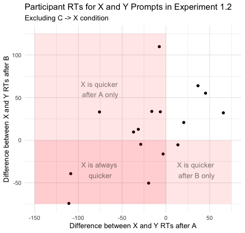
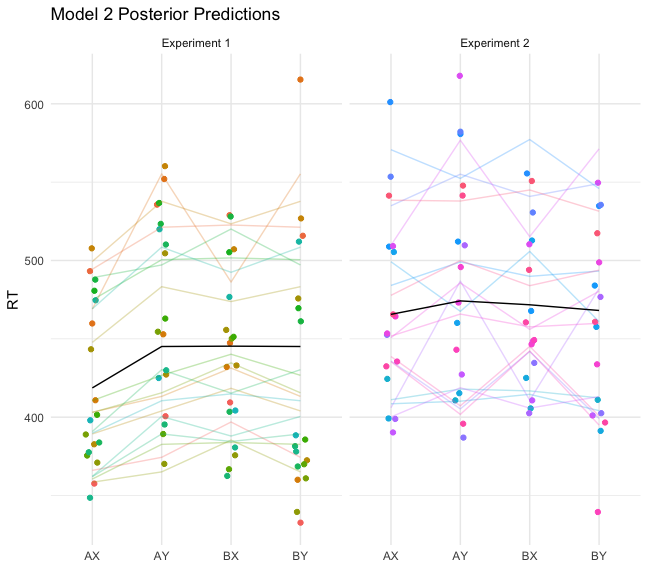
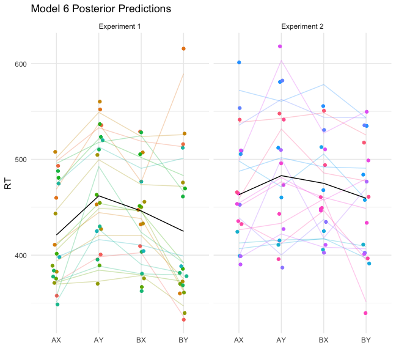

All code for this write-up can be found in model_comparisons.R

# How do Humans Structure Conditionally-Dependent Predictions?
Human-made machines tend to be carefully designed and callibrated for particular situations. But humans themselves are impressibly versatile. One component of this versatility is our ability to "predict" situations that may arise and prepare for them appropriately.

I write "predict" in scare quotes because prediction is a cognitive concept, and an ill-defined one at that. As we shall see, much of conditionally-dependent behavior can be explained by simple association. 

In our two pilot experiments, participants pressed one key if `X` appeared and another if `Y`. Two cues, `A` and `B`, had no direct relevance to the task, but could be used to predict whether `X` or `Y` was to follow.
Experiment 1.1 looks like this, where at each level (left to right) the colored veins represent conditional probabilities of the next stimulus occuring:


Let's get an initial look at the data. I'm interested to see how consistent patterns are across participants.


Some initial subjective observations:
- There are clear individual differences in intercept (i.e. participants with fast RTs in one condition tend to have fast RTs across the board). This is not surprising.
- Almost all participants were faster for `A`→ `X` than for `A`→ `Y`. Most were also faster for `B`→ `Y` than for `B`→ `X`. This shows a clear effect of cue-conditional probability. Nevertheless, the fact that the `B` conditions showed less consistency in this pattern suggests that global probability of probes (or less practice with the `B` cue) may play a role. 

Experiment 1.2 looks like this:


Some initial subjective observations:
- I see no clear pattern of differences between `A`→ `X` and `A`→ `Y` (even though the initial analysis did show that `A`→ `Y` was significantly longer). Some participants were faster on one, some on the other, and some barely different. I likewise see no clear pattern of differences between `B`→ `X` and`B`→ `Y`. 
- It does, however, look to me like participants who's times go up from `A`→ `X` to `A`→ `Y` also go up from `B`→ `X` to `B`→ `Y`, and vice versa. The magnitude of those differences also looks to vary by participant. Also, it looks a bit like participants who are faster on `Y`s relative to `X`s in the first four conditions also tend to be slower on `C` → `X`. In other words, it looks like there are individual differences in the extent to which people rely on cues or prompts for their predictions. Are my eyes decieving me? Let's look at some quick and dirty correlations.
```r
d2_agg %>%
  pivot_wider(id_cols = ID, names_from = condition, names_prefix = "RT_", values_from = RT) %>%
  mutate(AXtoAY_diff = RT_AX - RT_AY,
         BXtoBY_diff = RT_BX - RT_BY,
         ABXtoCX_diff = mean(c(RT_AX, RT_BX)) - RT_CX) %>%
  ungroup() %>%
  select(AXtoAY_diff:ABXtoCX_diff) %>%
  cor() %>%
  ggcorrplot(lab = T, type = "upper", title = "Experiment 1.2 Within-Participant Correlations")
```


Sure enough! This looks like initial evidence for individual differences in the extent to which participants are reliant on global (i.e. non-cue dependent) predictions. 

Is this pattern also in the experiment 1.1 results? Maybe. There, `AXtoAY_diff` and `BXtoBY_diff` are correlated at 0.205 - small, but still positive.

Before I continue, I'd like to take a closer look at the correlation between `AXtoAY_diff` and `BXtoBY_diff` in experiment 1.2. 



The "X is always quicker" group must be relying primarily on task-global probabilities of the prompts, which strongly favor X (X appears 80% of the time across conditions). The "X is quicker after A only" group is presumably more able to account for conditional probabilities, which favor X after A (67%) but not after B (33%). Unsurprisingly, this is the biggest group. 
The last two groups, for which Y is quicker after the A cue (or always), are the most strange to me. Maybe these are people with low sensitivity to any predictive cues who ended up there by random chance?
Here's the plot of Exp 1.2 results again, with those five participants highlighted.


The green one is what I expected here: slow all around, with little effect of condition at all. But the others are the fastest of the bunch! Not only that - they're especially fast on CX! This is very strange.

In the absence of a clear direction to go from here, I'll start trying some models.

### Model Comparisons
#### The Dataset
Each participant in the experiments underwent between three and four hundred trials. Since the models I'll be using here account for individual differences, I can train them with a split dataset: Trials are randomly distributed into one of two groups, and then averaged within participants/conditions. This effectively doubles the sample size.

Also, raw probabiilties of outcomes (e.g. conditional probability of `A`→ `X` in Exp. 1.1 = .8) have been transformed into log-odds. This means we can't use data from the `C`→ `X` condition (logit function goes to infinity as p approaches 1), but it should allow us to assume homoskedasticity.

```r
> d_agg2 %>% select(ID, experiment, condition, RT, odds_global, odds_conditional, odds_conjunction)
# A tibble: 272 × 7
       ID experiment   condition odds_global odds_conditional odds_conjunction    RT
    <int> <chr>        <chr>           <dbl>            <dbl>            <dbl> <dbl>
 1 166623 Experiment 1 AX              0.754             1.39            0.575  357.
 2 166623 Experiment 1 AY             -0.754            -1.39           -1.66   400.
 3 166623 Experiment 1 BX              0.754            -1.39           -3.18   393 
 4 166623 Experiment 1 BY             -0.754             1.39           -1.66   324 
 5 166623 Experiment 1 AX              0.754             1.39            0.575  358.
 6 166623 Experiment 1 AY             -0.754            -1.39           -1.66   402.
 7 166623 Experiment 1 BX              0.754            -1.39           -3.18   414.
 8 166623 Experiment 1 BY             -0.754             1.39           -1.66   344.
 9 166626 Experiment 1 AX              0.754             1.39            0.575  504.
10 166626 Experiment 1 AY             -0.754            -1.39           -1.66   538.
# … with 262 more rows
```

In this round, I'll be using Bayesian methodology since brms allows me more flexibility in defining systems of equations. This will be helpful for Model 6 and beyond.

#### Model 0: Conditional Probability Only
If participants fully understood the structure of the experiment, and behaved optimally, the resulting predictions would reflect cue-conditional probabilities. Thus if `A` appeared in experiment 1.1, the optimal prediction engine would evaluate the probability of `X` at .8 and of `Y` at .2. Likewise is `B` appeared, the engine would evaluate P(`X`|`B`) at .2 and P(`Y`|`B`) at .8. Thus reaction times would be equally short for the sequences `A`→ `X` and `B`→ `Y`, since P(`X`|`A`) = P(`Y`|`B`). Reaction times for `A`→ `Y` and `B`→ `X` would be longer, but likewise equal.

```r
# Using nonlinear syntax for consistency with later models.
aggmod_0_bayes <-
  brm(data = d_agg2, 
      family = gaussian,
      bf(RT ~ i + m,
         i ~ (1 | cor | ID),
         m ~ 0 + odds_conditional + (0 + odds_conditional | cor | ID),
         nl = TRUE),
      prior = c(prior(normal(450, 100), coef = "Intercept", nlpar = i),
                prior(normal(-12, 20), coef = "odds_conditional", nlpar = m)),
      iter = 5000, warmup = 2000, chains = 4, cores = 4)
      
# This should be equivalent to the following in lme4 syntax:
# lmer(RT ~ 1 + odds_conditional (1 + odds_conditional | ID), d_agg2)
```

##### Results
```r
> summary(aggmod_0_bayes)
 Family: gaussian 
  Links: mu = identity; sigma = identity 
Formula: RT ~ i + m 
         i ~ (1 | cor | ID)
         m ~ 0 + odds_conditional + (0 + odds_conditional | cor | ID)
   Data: d_agg2 (Number of observations: 272) 
  Draws: 4 chains, each with iter = 5000; warmup = 2000; thin = 1;
         total post-warmup draws = 12000

Group-Level Effects: 
~ID (Number of levels: 34) 
                                    Estimate Est.Error l-95% CI u-95% CI Rhat Bulk_ESS Tail_ESS
sd(i_Intercept)                        59.13      7.68    45.94    75.81 1.00     1844     3555
sd(m_odds_conditional)                  6.34      2.98     0.69    12.35 1.00     2679     3074
cor(i_Intercept,m_odds_conditional)     0.34      0.33    -0.39     0.91 1.00     8108     5475

Population-Level Effects: 
                   Estimate Est.Error l-95% CI u-95% CI Rhat Bulk_ESS Tail_ESS
i_Intercept          453.90     10.48   432.32   474.11 1.01     1100     1977
m_odds_conditional   -11.74      2.23   -16.06    -7.32 1.00     6600     7573

Family Specific Parameters: 
      Estimate Est.Error l-95% CI u-95% CI Rhat Bulk_ESS Tail_ESS
sigma    32.62      1.58    29.66    35.89 1.00     6357     7607
```
Looking alright. Let's move on though. It was obvious from the first look at the data this is not the right model (e.g. `A`→ `X` and `B`→ `Y` have the same conditional probabilities but differ significantly in RT).

#### Model 1: Summed Parallel Predictions
Maybe conditional probability is not the whole story. Context-clues in the real world often come at many levels of temporal and conceptual abstraction. Perhaps participants are generating one assessment of outcome probability based on the task as a whole (`p_global`) and another on the cues alone (`p_conditional`).

```r
aggmod_1_bayes <-
  brm(data = d_agg2, 
      family = gaussian,
      bf(RT ~ i + m,
         i ~ (1 | cor | ID),
         m ~ 0 + odds_global + odds_conditional + (0 + odds_global + odds_conditional | cor | ID),
         nl = TRUE),
      prior = c(prior(normal(450, 100), coef = "Intercept", nlpar = i),
                prior(normal(-3, 20), coef = "odds_global", nlpar = m),
                prior(normal(-12, 20), coef = "odds_conditional", nlpar = m)),
      iter = 5000, warmup = 2000, chains = 4, cores = 4)
      
# This should be equivalent to the following in lme4 syntax:
# lmer(RT ~ 1 + odds_global + odds_conditional + (1 + odds_global + odds_conditional | ID), d_agg2)
 ```

##### Results
```r
 Family: gaussian 
  Links: mu = identity; sigma = identity 
Formula: RT ~ i + m 
         i ~ (1 | ID)
         m ~ 0 + odds_global + odds_conditional + (0 + odds_global + odds_conditional | ID)
   Data: d_agg2 (Number of observations: 272) 
  Draws: 4 chains, each with iter = 5000; warmup = 2000; thin = 1;
         total post-warmup draws = 12000

Group-Level Effects: 
~ID (Number of levels: 34) 
                                      Estimate Est.Error l-95% CI u-95% CI Rhat Bulk_ESS Tail_ESS
sd(i_Intercept)                          59.13      7.59    46.40    75.85 1.00     1884     3756
sd(m_odds_global)                        18.87      3.21    13.46    25.90 1.00     3545     6627
sd(m_odds_conditional)                    8.91      2.25     4.85    13.65 1.00     4096     6112
cor(m_odds_global,m_odds_conditional)    -0.52      0.24    -0.93     0.01 1.00     4222     4851

Population-Level Effects: 
                   Estimate Est.Error l-95% CI u-95% CI Rhat Bulk_ESS Tail_ESS
i_Intercept          453.74     10.34   433.30   474.56 1.00     1153     2373
m_odds_global         -4.84      3.48   -11.84     1.90 1.00     3371     6344
m_odds_conditional   -12.32      2.14   -16.56    -8.00 1.00     7431     8408

Family Specific Parameters: 
      Estimate Est.Error l-95% CI u-95% CI Rhat Bulk_ESS Tail_ESS
sigma    25.34      1.41    22.76    28.25 1.00     6829     8664
```


This model seems to fit the data fairly well, actually. In fact, it even seems to have picked up on the strange individual differences I discussed above (found especially in Exp. 1.2), with zigzags going both ways. This may be connected to the fact the model is estimating a *positive* effect of global odds for lots of the participants. This is strange and seems probably wrong - higher global frequencies cause some people to take *longer*!? I'll come back to this.

Another interesting finding: the parameters for `odds_global` and `odds_conditional` are negatively correlated between participants. In other words, people who rely more on global odds show less sensitivity to conditional odds.

#### Model 2: Summed Proportional Stimulus-Response Associations
Perhaps prediction is not prediction at all but rather simply the sum of stimulus-response associations. This view produces a model similar to Model 1 but subtly different.
Both experiments involve two sets of stimuli: prompts (`X` and `Y`) and cues (`A` and `B`). These four stimuli are linked to two responses, corresponding to the two prompts. 
Associations between prompts and their corresponding responses are likely to be very strong, as participants were thoroughly drilled in the paradigm prior to the test phase. Nevertheless, these connections may be variably strenghtened in proportion to the number of times participants were exposed to each stimulus-response pair. This proportion of course is equal to the global probability of each prompt appearing within the paradigm, independent of cues (`p_global`). 
Associations between cues and responses would likewise vary by frequency of exposure. Since different cues appear with different frequencies, and since the frequencies of each response are conditional on the cue, connections between cues and responses should be proportional to the product of cue probability (`p_cue`) and conditional probability (`p_conditional`). I'll call this value `p_conjunction`.

```r
d_agg2 <- d_agg2 %>% mutate(p_conjunction = p_cue*p_conditional)
# odds_conjunction will then be log-odds of p_conjunction
```
Model 2 can therefore be formulated as follows:

```r
aggmod_2_bayes <-
  brm(data = d_agg2, 
      family = gaussian,
      bf(RT ~ i + mf,
         i ~ (1 | cor | ID),
         mf ~ 0 + odds_global + odds_conjunction + (0 + odds_global + odds_conjunction | cor | ID),
         nl = TRUE),
      prior = c(prior(normal(450, 100), coef = "Intercept", nlpar = i),
                prior(normal(-3, 20), coef = "odds_global", nlpar = mf),
                prior(normal(-12, 20), coef = "odds_conjunction", nlpar = mf)),
      iter = 5000, warmup = 2000, chains = 4, cores = 4)

# This should be equivalent to the following in lme4 syntax:
# lmer(RT ~ 1 + odds_global + odds_conjunction + (1 + odds_global + odds_conjunction | ID), d_agg2)
```

##### Results
```r
 Family: gaussian 
  Links: mu = identity; sigma = identity 
Formula: RT ~ i + mf 
         i ~ (1 | ID)
         mf ~ 0 + odds_global + odds_conjunction + (0 + odds_global + odds_conjunction | ID)
   Data: d_agg2 (Number of observations: 272) 
  Draws: 4 chains, each with iter = 5000; warmup = 2000; thin = 1;
         total post-warmup draws = 12000

Group-Level Effects: 
~ID (Number of levels: 34) 
                                        Estimate Est.Error l-95% CI u-95% CI Rhat Bulk_ESS Tail_ESS
sd(i_Intercept)                            58.26      7.81    44.99    75.82 1.00     2434     4772
sd(mf_odds_global)                         16.76      3.29    11.00    23.83 1.00     4340     7073
sd(mf_odds_conjunction)                     2.54      1.87     0.10     6.91 1.00     3014     4163
cor(mf_odds_global,mf_odds_conjunction)    -0.29      0.52    -0.97     0.85 1.00     8026     8284

Population-Level Effects: 
                    Estimate Est.Error l-95% CI u-95% CI Rhat Bulk_ESS Tail_ESS
i_Intercept           439.56     10.72   418.43   460.78 1.00     1636     3054
mf_odds_global         -4.09      3.48   -11.06     2.62 1.00     4966     7298
mf_odds_conjunction    -7.43      1.96   -11.38    -3.56 1.00    14127     8431

Family Specific Parameters: 
      Estimate Est.Error l-95% CI u-95% CI Rhat Bulk_ESS Tail_ESS
sigma    30.88      1.60    27.94    34.20 1.00    10029     8816
```



Hard to tell the difference from the visual alone. It does look to be missing a lot on the `B`→ `Y` condition in Experiment 1, though. It's missing some importance of conditional odds.

#### Model 4: LTM = Summed Proportional Associations, WM = Conditional Load Threshold
```diff
! This section is now outdated. Skip to Model 6.
```

So far we've seen that conditional probability is a really strong predictor of the Experiment 1 results, while Experiment 2 results are much more closely tied to `p_posterior` (i.e. cue probability times cue-conditional probability). What could account for this difference between the two experiments?

Ness and Meltzer-Asscher (2021) propose the following model for linguistic processing: "At every stage during sentence processing, multiple representations in long-term memory are pre-activated. Many different factors contribute to the activation level of a word: the context, lexical properties of the word (e.g., frequency), idiosyncratic influences, and random noise. Once the activation level of a certain word reaches a retrieval threshold, this word is regarded as retrieved, which initiates its integration into the sentence's representation being built in WM." 

In short, Ness and Meltzer-Asscher posit a LTM mechanism similar to the one formulated here in Model 2. In addition, though, they propose that when one prediction reaches a certain level of LTM activation (the threshold), it is updated into WM and recieves a boost. 

A slight modification of this model might account for our data nicely: Perhaps the threshold for WM pre-updating is based on a more top-down predictive process (one that closely approximates `p_conditional`), such that the model could be formulated as follows (with the thresholded boost modeled as a steep logistic function):

```r
aggmod_4 <- nlme::nlme(RT ~ b0 + b1*p_global + b2*p_posterior + b3*plogis(500*(p_conditional + brk)),
                    data = d_agg,
                    fixed = b0 + b1 + b2 + b3 + brk ~ 1,
                    random = b0 + brk ~ 1,
                    groups = ~ ID,
                    start = coef(naive_mod_4))
```

For the sake of simplicity, I'm starting by letting only the Intercept and the threshold vary by participant. Also, since the model is so complex, I'm modeling it only on the full dataset.

Placing the threshold in conditional probability is not as crazy as it may sound - late ERP positivity effects such as the P600 provide some evidence that the brain can incur additional neural consequences when it encounters words that violate highly constraining contexts, over and above those reflected by the N400 ([Kuperberg & Jaeger, 2016](https://www.tandfonline.com/doi/pdf/10.1080/23273798.2015.1102299?needAccess=true)).[Kuperberg (2007)](https://reader.elsevier.com/reader/sd/pii/S0006899306036821?token=DBAD6CA0B990F7C4A3F867A445220DF83A72944AE05923A161B970FEAF6E897559A6C8A2B35EF0427BE056A371F3850B&originRegion=eu-west-1&originCreation=20221123114908) goes so far as to propose two distinct streams in language processing: one purely lexical/associational and one that incorporates higher-level (e.g. syntactic) knowledge.

#### Model 6: LTM = Summed Proportional Associations, WM = Resource-Optimal Model-Based Prediction
The reinforcement learning literature commonly distinguishes between _model-free_ and _model-based_ analysis. Model-free analysis is analogous to the associational LTM system discussed above in Model 2. Model-based analysis is more effortful, presumably entailing working memory resources. On the other hand, it has the benefit of accounting for latent causal structure in the environment, rather than just stimulus-response associations. This means that the use of model-based processing to generate predictions entails a cost-benefit analysis -- people will tend to use model-based analysis only inasmuch as it is likely to aid them in prediction above and beyond the model-free system.

Here I model this with an expected utility term, the absolute difference between model-free and model-based prediction, or `fabs(mf - mb)`. The effect of model-based prediction (i.e. conditional odds) is fully moderated by this expected utility.

I'm telling the model to estimate correlations between all the random variables, and inputting fairly skeptical priors based roughly on a simple linear version of the same model.

```r
aggmod_6_bayes <-
  brm(data = d_agg2, 
    family = gaussian,
    bf(RT ~ i + mf + b1*(fabs(mf - mb)*mb),
       i ~ (1 | cor | ID),
       mf ~ 0 + odds_global + odds_conjunction + (0 + odds_global + odds_conjunction | cor | ID),
       b1 ~ (1 | cor | ID),
       mb ~ 0 + odds_conditional,
       nl = TRUE),
    prior = c(prior(normal(450, 100), coef = "Intercept", nlpar = i),
              prior(normal(-5, 20), coef = "odds_global", nlpar = mf),
              prior(normal(-5, 20), coef = "odds_conjunction", nlpar = mf),
              prior(normal(-10, 20), coef = "Intercept", nlpar = b1),
              prior(constant(1), coef = "odds_conditional", nlpar = mb)),
    iter = 5000, warmup = 2000, chains = 4, cores = 4)

# To my knowledge, this model is not possible to specify using lme4.
```



Before I dive into the parameters of the model, I'll provide some justification for my use of such a complex model.
Here are some Bayesian model comparisons based on leave-one-out cross-validation:

```r
> loo_compare(aggmod_0_bayes, aggmod_1_bayes, aggmod_2_bayes, aggmod_6_bayes, criterion = "loo")
                           elpd_diff se_diff
aggmod_6_bayes               0.0       0.0  
aggmod_1_bayes             -23.7      18.8  
aggmod_2_bayes             -64.2      19.1  
aggmod_0_bayes             -69.7      19.6  
```

Model 6 seems to be the best model so far, though Model 1 isn't far behind. 

Here are the results:
```r
> summary(aggmod_6_bayes)
 Family: gaussian 
  Links: mu = identity; sigma = identity 
Formula: RT ~ i + mf + b1 * (fabs(mf - mb) * mb) 
         i ~ (1 | cor | ID)
         mf ~ 0 + odds_global + odds_conjunction + (0 + odds_global + odds_conjunction | cor | ID)
         b1 ~ (1 | cor | ID)
         mb ~ 0 + odds_conditional
   Data: d_agg2 (Number of observations: 272) 
  Draws: 4 chains, each with iter = 5000; warmup = 2000; thin = 1;
         total post-warmup draws = 12000

Group-Level Effects: 
~ID (Number of levels: 34) 
                                        Estimate Est.Error l-95% CI u-95% CI Rhat Bulk_ESS Tail_ESS
sd(i_Intercept)                            58.80      7.97    45.05    76.84 1.00     1651     2928
sd(mf_odds_global)                         18.38      2.97    13.22    24.90 1.00     3039     5391
sd(mf_odds_conjunction)                     3.77      1.16     1.94     6.47 1.00     3202     4807
sd(b1_Intercept)                            0.70      0.21     0.38     1.18 1.00     3045     5363
cor(i_Intercept,mf_odds_global)            -0.19      0.17    -0.50     0.16 1.00     2492     4457
cor(i_Intercept,mf_odds_conjunction)       -0.19      0.28    -0.70     0.39 1.00     3054     5538
cor(mf_odds_global,mf_odds_conjunction)     0.72      0.19     0.27     0.97 1.00     3393     5896
cor(i_Intercept,b1_Intercept)               0.20      0.26    -0.31     0.68 1.00     5770     6700
cor(mf_odds_global,b1_Intercept)           -0.48      0.20    -0.83    -0.07 1.00     3865     4750
cor(mf_odds_conjunction,b1_Intercept)      -0.23      0.30    -0.78     0.37 1.00     2037     3806

Population-Level Effects: 
                    Estimate Est.Error l-95% CI u-95% CI Rhat Bulk_ESS Tail_ESS
i_Intercept           453.85     10.11   433.65   473.54 1.00      829     1827
mf_odds_global         -3.93      3.47   -10.98     2.83 1.00     1742     3215
mf_odds_conjunction     0.14      1.28    -2.27     2.82 1.00     1980     4796
b1_Intercept           -1.05      0.22    -1.54    -0.66 1.00     4820     6084
mb_odds_conditional     1.00      0.00     1.00     1.00   NA       NA       NA

Family Specific Parameters: 
      Estimate Est.Error l-95% CI u-95% CI Rhat Bulk_ESS Tail_ESS
sigma    22.90      1.33    20.46    25.65 1.00     3662     7614
```

A few things that make sense about these results:
- The two component effects of model-free prediction are highly correlated with each other. 
- The Intercept is negatively correlated with the components of model-free prediction, and positively correlated with the effect of model-based prediction. 
- The two component effects of model-free prediction are stongly negatively correlated with the effect of model-based prediction. 

One thing that doesn't make sense about these results:
- The estimated global effect of `odds_conjunction` is slightly _positive_. In fact, the group-level standard deviations of both model-free effects are so large that the model estimates large positive effects for a sizable proportion of the participants. The idea that model-free predictions -- which supposedly require minimal processing time -- would have _positive_ influences on reaction times is incomprehensible to me. 

```r
aggmod_6_bayes_constrained <-
  brm(data = d_agg2, 
      family = gaussian,
      bf(RT ~ i - mf + b1*(fabs(mf - mb)*mb),
         i ~ (1 | cor | ID),
         mf ~ 0 + odds_global + odds_conjunction + (0 + odds_global + odds_conjunction | cor | ID),
         b1 ~ (1 | cor | ID),
         mb ~ 0 + odds_conditional,
         nl = TRUE),
      prior = c(prior(normal(450, 100), coef = "Intercept", nlpar = i),
                prior(normal(-5, 20), class = "b", nlpar = mf, ub = 0),
                prior(normal(-10, 20), coef = "Intercept", nlpar = b1),
                prior(constant(1), coef = "odds_conditional", nlpar = mb)),
      iter = 5000, warmup = 2000, chains = 4, cores = 4)
```

