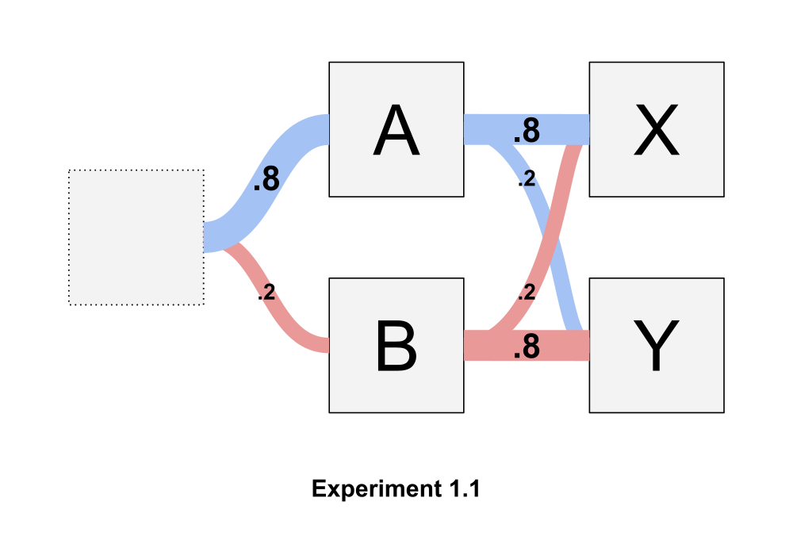
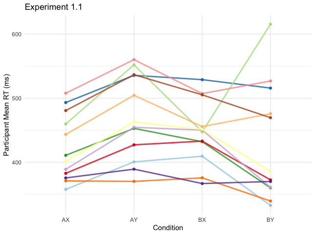
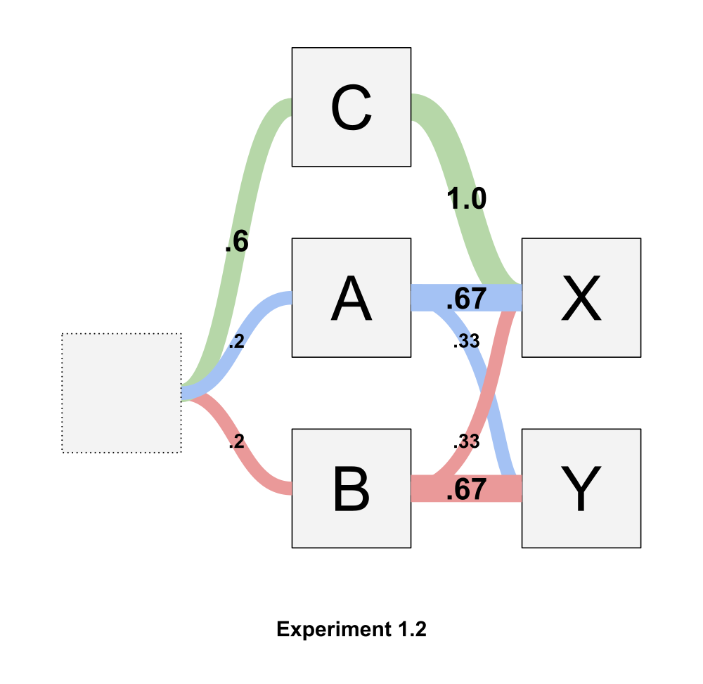
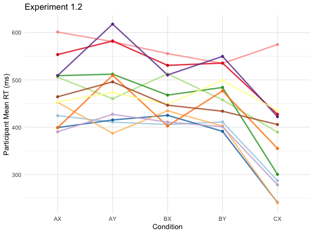
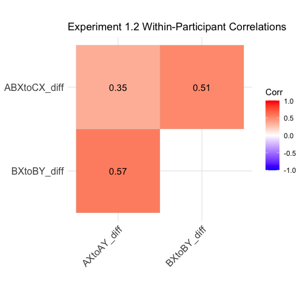
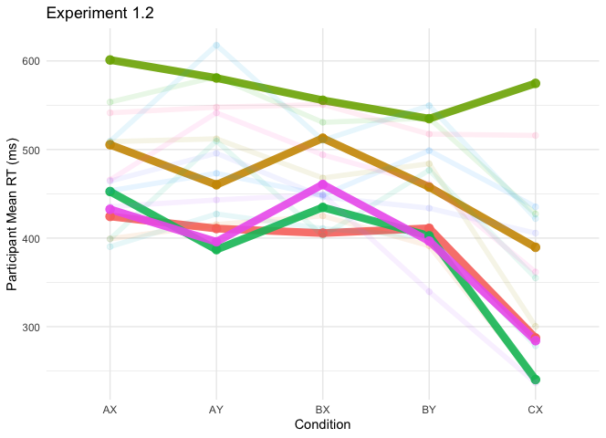
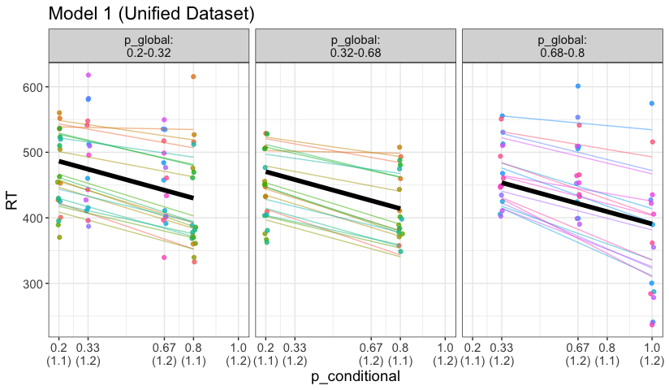
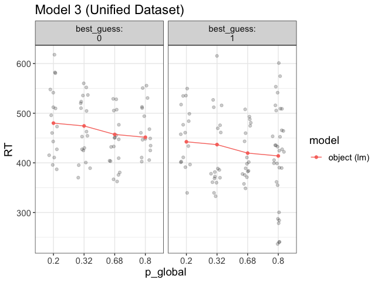

# How do Humans Structure Conditionally-Dependent Predictions?
Human-made machines tend to be carefully designed and callibrated for particular situations. But humans themselves are impressibly versatile. One component of this versatility is our ability to "predict" situations that may arise and prepare for them appropriately.

I write "predict" in scare quotes because prediction is a cognitive concept, and an ill-defined one at that. As we shall see, much of conditionally-dependent behavior can be explained by simple association. 

In our two pilot experiments, participants pressed one key if `X` appeared and another if `Y`. Two cues, `A` and `B`, had no direct relevance to the task, but could be used to predict whether `X` or `Y` was to follow.
Experiment 1.1 looks like this, where at each level (left to right) the colored veins represent conditional probabilities of the next stimulus occuring:


Let's get an initial look at the data. I'm interested to see how consistent patterns are across participants.


Some initial subjective observations:
- There are clear individual differences in intercept (i.e. participants with fast RTs in one condition tend to have fast RTs across the board). This is not surprising.
- Almost all participants were faster for `A`→ `X` than for `A`→ `Y`. Most were also faster for `B`→ `Y` than for `B`→ `X`. This shows a clear effect of cue-conditional probability. Nevertheless, the fact that the `B` conditions showed less consistency in this pattern suggests that global probability of probes (or less practice with the `B` cue) may play a role. 

Experiment 1.2 looks like this:




Some initial subjective observations:
- I see no clear pattern of differences between `A`→ `X` and `A`→ `Y` (even though the initial analysis did show that `A`→ `Y` was significantly longer). Some participants were faster on one, some on the other, and some barely different. I likewise see no clear pattern of differences between `B`→ `X` and`B`→ `Y`. 
- It does, however, look to me like participants who's times go up from `A`→ `X` to `A`→ `Y` also go up from `B`→ `X` to `B`→ `Y`, and vice versa. The magnitude of those differences also looks to vary by participant. Also, it looks a bit like participants who are faster on `Y`s relative to `X`s in the first four conditions also tend to be slower on `C` → `X`. In other words, it looks like there are individual differences in the extent to which people rely on cues or prompts for their predictions. Are my eyes decieving me? Let's look at some quick and dirty correlations.
```r
d2_agg %>%
  pivot_wider(id_cols = ID, names_from = condition, names_prefix = "RT_", values_from = RT) %>%
  mutate(AXtoAY_diff = RT_AX - RT_AY,
         BXtoBY_diff = RT_BX - RT_BY,
         ABXtoCX_diff = mean(c(RT_AX, RT_BX)) - RT_CX) %>%
  ungroup() %>%
  select(AXtoAY_diff:ABXtoCX_diff) %>%
  cor() %>%
  ggcorrplot(lab = T, type = "upper", title = "Experiment 1.2 Within-Participant Correlations")
```


Sure enough! This looks like initial evidence for individual differences in the extent to which participants are reliant on global (i.e. non-cue dependent) predictions. 

Is this pattern also in the experiment 1.1 results? Maybe. There, `AXtoAY_diff` and `BXtoBY_diff` are correlated at 0.205 - small, but still positive.

Before I continue, I'd like to take a closer look at the correlation between `AXtoAY_diff` and `BXtoBY_diff` in experiment 1.2. 


The "X is always quicker" group must be relying primarily on task-global probabilities of the prompts, which strongly favor X (X appears 80% of the time across conditions). The "X is quicker after A only" group is presumably more able to account for conditional probabilities, which favor X after A (67%) but not after B (33%). Unsurprisingly, this is the biggest group. 
The last two groups, for which Y is quicker after the A cue (or always), are the most strange to me. Maybe these are people with low sensitivity to any predictive cues who ended up there by random chance?
Here's the plot of Exp 1.2 results again, with those five participants highlighted.



The green one is what I expected here: slow all around, with little effect of condition at all. But the others are the fastest of the bunch! Not only that - they're especially fast on CX! This is very strange.

In the absence of a clear direction to go from here, I'll start trying some models.

### Model Comparisons
#### The Dataset
The following models will be trained three times each: once on the data from experiment 1.1, once on the data from experiment 1.2, and once on a unified dataset. All datasets are aggregated by participant means within each condition.

```r
> d_agg
# A tibble: 152 × 10
# Groups:   ID, condition, cue, probe, p_cue, p_global, p_conditional [152]
       ID condition cue   probe p_cue p_global p_conditional best_guess    RT correct
    <int> <chr>     <chr> <chr> <dbl>    <dbl>         <dbl>      <dbl> <dbl>   <dbl>
 1 166623 AX        A     X       0.8     0.68           0.8          1  358.       1
 2 166623 AY        A     Y       0.8     0.32           0.2          0  401.       1
 3 166623 BX        B     X       0.2     0.68           0.2          0  409.       1
 4 166623 BY        B     Y       0.2     0.32           0.8          1  333.       1
 5 166626 AX        A     X       0.8     0.68           0.8          1  493.       1
 6 166626 AY        A     Y       0.8     0.32           0.2          0  536.       1
 7 166626 BX        B     X       0.2     0.68           0.2          0  529.       1
 8 166626 BY        B     Y       0.2     0.32           0.8          1  516.       1
 9 166640 AX        A     X       0.8     0.68           0.8          1  460.       1
10 166640 AY        A     Y       0.8     0.32           0.2          0  552        1
# … with 142 more rows
```
The initial hints at individual differences mean that multilevel modelling is appropriate here. But what should the parameters be?

#### Model 0: Conditional Probability Only
If participants fully understood the structure of the experiment, and behaved optimally, the resulting predictions would reflect cue-conditional probabilities. Thus if `A` appeared in experiment 1.1, the optimal prediction engine would evaluate the probability of `X` at .8 and of `Y` at .2. Likewise is `B` appeared, the engine would evaluate P(`X`|`B`) at .2 and P(`Y`|`B`) at .8. Thus reaction times would be equally short for the sequences `A`→ `X` and `B`→ `Y`, since P(`X`|`A`) = P(`Y`|`B`). Reaction times for `A`→ `Y` and `B`→ `X` would be longer, but likewise equal.

```r
aggmod_0 <- lmer(RT ~ 1 + p_conditional + (1 + p_conditional | ID), d_agg)
```
##### Results
```r
Formula: RT ~ 1 + p_conditional + (1 + p_conditional | ID)
   Data: d_agg

Fixed effects:
              Estimate Std. Error t value
(Intercept)     498.40      11.26  44.273
p_conditional   -99.83      14.29  -6.988

Correlation of Fixed Effects:
            (Intr)
p_conditinl -0.466

Formula: RT ~ 1 + p_conditional + (1 + p_conditional | ID)
   Data: d1_agg

Fixed effects:
              Estimate Std. Error t value
(Intercept)     465.91      13.34  34.933
p_conditional   -56.06      12.55  -4.469

Correlation of Fixed Effects:
            (Intr)
p_conditinl -0.200

Formula: RT ~ 1 + p_conditional + (1 + p_conditional | ID)
   Data: d2_agg

Fixed effects:
              Estimate Std. Error t value
(Intercept)     542.76      14.27  38.048
p_conditional  -156.97      22.71  -6.913

Correlation of Fixed Effects:
            (Intr)
p_conditinl -0.357
```
Looking alright. The coefficient for the effect of p_conditional does vary drastically between the two experiments. Looking at the visual, it seems clear that this can be attributed to the `C` condition in Experiment 1.2.


While the `C` condition in Experiment 1.2 has by far the lowest RTs, the other two conditions in that experiment seems hardly different. They also seem quite a bit higher than the model expects them to be. 

Worst of all, a few of these groups look to be clustered. Especially the two Experiment 1 groups seem to be split along the y axis. Remember that `p_conditional` = 0.2 contains both `A`→ `Y` and `B`→ `X`, and `p_conditional` = 0.8 contains both `A`→ `X` and `B`→ `Y`.

#### Model 1: Summed Parallel Predictions
Maybe conditional probability is not the whole story. Context-clues in the real world often come at many levels of temporal and conceptual abstraction. Perhaps participants are generating one assessment of outcome probability based on the task as a whole (`p_global`) and another on the cues alone (`p_conditional`).

```r
aggmod_1 <- lmer(RT ~ 1 + p_global + p_conditional + (1 + p_global + p_conditional | ID), d_agg)
```

##### Results
```r
Formula: 
RT ~ 1 + p_global + p_conditional + (1 + p_global + p_conditional | ID)
   Data: d_agg

Fixed effects:
              Estimate Std. Error t value
(Intercept)     515.37      12.73  40.488
p_global        -38.39      13.51  -2.843
p_conditional   -94.07      14.17  -6.639

Correlation of Fixed Effects:
            (Intr) p_glbl
p_global    -0.508       
p_conditinl -0.214 -0.290

Formula: 
RT ~ 1 + p_global + p_conditional + (1 + p_global + p_conditional | ID)
   Data: d1_agg

Fixed effects:
              Estimate Std. Error t value
(Intercept)     489.18      19.51  25.068
p_global        -46.54      23.74  -1.960
p_conditional   -56.06      12.13  -4.623

Correlation of Fixed Effects:
            (Intr) p_glbl
p_global    -0.748       
p_conditinl  0.245 -0.596

Formula: 
RT ~ 1 + p_global + p_conditional + (1 + p_global + p_conditional | ID)
   Data: d2_agg

Fixed effects:
              Estimate Std. Error t value
(Intercept)     550.30      15.61  35.251
p_global        -22.72      16.94  -1.341
p_conditional  -148.33      23.92  -6.201

Correlation of Fixed Effects:
            (Intr) p_glbl
p_global    -0.422       
p_conditinl -0.161 -0.339
```
This model seems to add very little to the last one. `p_global` has a small effect, if any. `p_conditional` = 0.33 and `p_conditional` = 0.67 again look to have higher RTs than the model expects. Interestingly enough, the `p_conditional` = 0.67 in the high p_global group seems to be higher than `p_conditional` = 0.33! Remember than this is the `A`→ `X` condition in Experiment 1.2.



#### Model 2: Summed Proportional Stimulus-Response Associations
Perhaps prediction is not prediction at all but rather simply the sum of stimulus-response associations. This view produces a model similar to Model 1 but subtly different.
Both experiments involve two sets of stimuli: prompts (`X` and `Y`) and cues (`A` and `B`). These four stimuli are linked to two responses, corresponding to the two prompts. 
Associations between prompts and their corresponding responses are likely to be very strong, as participants were thoroughly drilled in the paradigm prior to the test phase. Nevertheless, these connections may be variably strenghtened in proportion to the number of times participants were exposed to each stimulus-response pair. This proportion of course is equal to the global probability of each prompt appearing within the paradigm, independent of cues (`p_global`). 
Associations between cues and responses would likewise vary by frequency of exposure. Since different cues appear with different frequencies, and since the frequencies of each response are conditional on the cue, connections between cues and responses should be proportional to the product of cue probability (`p_cue`) and conditional probability (`p_conditional`). I'll call this value `p_posterior`.

```r
d_agg <- d_agg %>% mutate(p_posterior = p_cue*p_conditional)
```
Model 2 can therefore be formulated as follows:

```r
aggmod_2 <- lmer(RT ~ 1 + p_global + p_posterior + (1 + p_global + p_posterior | ID), d_agg)
```

##### Results
```r
Formula: RT ~ 1 + p_global + p_posterior + (1 + p_global + p_posterior | ID)
   Data: d_agg

Fixed effects:
            Estimate Std. Error t value
(Intercept)   476.91      13.14  36.290
p_global      -14.82      14.43  -1.027
p_posterior  -121.72      22.21  -5.481

Correlation of Fixed Effects:
            (Intr) p_glbl
p_global    -0.651       
p_posterior  0.067 -0.361

Formula: RT ~ 1 + p_global + p_posterior + (1 + p_global + p_posterior | ID)
   Data: d1_agg

Fixed effects:
            Estimate Std. Error t value
(Intercept)   461.15      22.02  20.938
p_global      -29.18      26.55  -1.099
p_posterior   -34.73      18.48  -1.880

Correlation of Fixed Effects:
            (Intr) p_glbl
p_global    -0.794       
p_posterior  0.056 -0.376

Formula: RT ~ 1 + p_global + p_posterior + (1 + p_global + p_posterior | ID)
   Data: d2_agg

Fixed effects:
            Estimate Std. Error t value
(Intercept)  494.188     16.516  29.921
p_global      -2.612     17.523  -0.149
p_posterior -220.721     32.618  -6.767

Correlation of Fixed Effects:
            (Intr) p_glbl
p_global    -0.659       
p_posterior  0.517 -0.463
```

This model seems to have accentuated the differences between the two Experiments: `p_posterior` is an incredible predictor in Experiment 1.2, but underwhelming in Exp. 1.1. `p_global` is once again weak, though always in the right direction.

At this point, let's stop and do a few formal model comparisons.
```r
library(flexplot)

model.comparison(aggmod_0, aggmod_1)
#>               aic      bic bayes.factor     p
#> aggmod_0 1633.919 1652.063        5.761 0.046
#> aggmod_1 1625.326 1655.565        0.174      

model.comparison(aggmod_0, aggmod_2)
#>               aic      bic bayes.factor
#> aggmod_0 1633.919 1652.063        1.846
#> aggmod_2 1623.050 1653.289        0.542

model.comparison(aggmod_1, aggmod_2)
#>               aic      bic bayes.factor
#> aggmod_1 1625.326 1655.565        0.320
#> aggmod_2 1623.050 1653.289        3.121


model.comparison(aggmod_0.1, aggmod_1.1)
#>                aic     bic bayes.factor      p
#> aggmod_0.1 741.188 754.848        0.003 <2e-16
#> aggmod_1.1 720.127 742.894      394.354   

model.comparison(aggmod_0.1, aggmod_2.1)
#>                aic     bic bayes.factor
#> aggmod_0.1 741.188 754.848     2989.857
#> aggmod_2.1 748.087 770.854        0.000

model.comparison(aggmod_1.1, aggmod_2.1)
#>                aic     bic bayes.factor
#> aggmod_1.1 720.127 742.894      1179063
#> aggmod_2.1 748.087 770.854            0


model.comparison(aggmod_0.2, aggmod_1.2)
#>                aic     bic bayes.factor     p
#> aggmod_0.2 859.817 874.109       54.335 0.718
#> aggmod_1.2 858.279 882.099        0.018      

model.comparison(aggmod_0.2, aggmod_2.2)
#>                aic     bic bayes.factor
#> aggmod_0.2 859.817 874.109            0
#> aggmod_2.2 819.678 843.498      4435544

model.comparison(aggmod_1.2, aggmod_2.2)
#>                aic     bic bayes.factor
#> aggmod_1.2 858.279 882.099            0
#> aggmod_2.2 819.678 843.498    241004557
```

Model 1 is best for Experiment 1.1, and Model 2 is best for Experiment 1.2. None of the models are particularly good overall.

#### Model 3: LTM = Base Rate, WM = Conditional Best Guess
Maybe difference levels of conditionally-dependent prediction are driven by different memory systems? If conditional probability were handled by working memory, its representation might be binary: either the prediction is being held in WM or not. If this is the case, perhaps, we just pick the most likely outcome and hold that in mind at each step. 

If long term memory holds only global probabilities, the model would then look like this:

```r
aggmod_3 <- lmer(1 + p_global + best_guess + (1 + p_global + best_guess | ID), d_agg)
```

##### Results
```r
Formula: RT ~ 1 + p_global + best_guess + (1 + p_global + best_guess | ID)
   Data: d_agg

Fixed effects:
            Estimate Std. Error t value
(Intercept)  491.018     13.076  37.550
p_global     -50.450     14.659  -3.442
best_guess   -39.016      7.512  -5.194

Correlation of Fixed Effects:
           (Intr) p_glbl
p_global   -0.629       
best_guess -0.058 -0.127

Formula: RT ~ 1 + p_global + best_guess + (1 + p_global + best_guess | ID)
   Data: d1_agg

Fixed effects:
            Estimate Std. Error t value
(Intercept)  477.965     20.245  23.610
p_global     -46.545     23.741  -1.961
best_guess   -33.639      7.276  -4.623

Correlation of Fixed Effects:
           (Intr) p_glbl
p_global   -0.793       
best_guess  0.356 -0.596

Formula: RT ~ 1 + p_global + best_guess + (1 + p_global + best_guess | ID)
   Data: d2_agg

Fixed effects:
            Estimate Std. Error t value
(Intercept)   504.08      18.73  26.908
p_global      -51.61      20.82  -2.479
best_guess    -44.34      12.90  -3.437

Correlation of Fixed Effects:
           (Intr) p_glbl
p_global   -0.535       
best_guess -0.121 -0.153
```
Finally, the coefficients look similar in all three model fits! Even visually, I don't see any egregious deviations from the model fit. 



To check whether `best_guess` is explaining any variance that `p_conditional` wasn't (`best_guess` is just a binned `p_conditional`), let's run that model again with both predictors.

```r
Formula: RT ~ 1 + p_global + p_conditional + best_guess + (1 + p_global +  
    p_conditional + best_guess | ID)
   Data: d_agg

Random effects:
 Groups   Name          Std.Dev. Corr             
 ID       (Intercept)    67.74                    
          p_global       69.30   -0.21            
          p_conditional 172.58   -0.22 -0.68      
          best_guess     56.83    0.08  0.73 -0.99
 Residual                22.64                    
Number of obs: 152, groups:  ID, 34

Fixed Effects:
  (Intercept)       p_global  p_conditional     best_guess  
       539.30         -26.81        -211.29          65.11  
```

Indeed, it looks like `best_guess` isn't doing anything except making the mixed-effects model confused about the independent effect of `p_conditional`.

#### Model 4: LTM = Summed Proportional Associations, WM = Conditional Load Threshold

So far we've seen that conditional probability is a really strong predictor of the Experiment 1 results, while Experiment 2 results are much more closely tied to `p_posterior` (i.e. cue probability times cue-conditional probability). What could account for this difference between the two experiments?

Ness and Meltzer-Asscher (2021) propose the following model for linguistic processing: "At every stage during sentence processing, multiple representations in long-term memory are pre-activated. Many different factors contribute to the activation level of a word: the context, lexical properties of the word (e.g., frequency), idiosyncratic influences, and random noise. Once the activation level of a certain word reaches a retrieval threshold, this word is regarded as retrieved, which initiates its integration into the sentence's representation being built in WM." 

In short, Ness and Meltzer-Asscher posit a LTM mechanism similar to the one formulated here in Model 2. In addition, though, they propose that when one prediction reaches a certain level of LTM activation (the threshold), it is updated into WM and recieves a boost. 

A slight modification of this model might account for our data nicely: Perhaps the threshold for WM pre-updating is based on a more top-down predictive process (one that closely approximates `p_conditional`), such that the model could be formulated as follows (with the thresholded boost modeled as a steep logistic function):

```r
aggmod_4 <- nlme::nlme(RT ~ b0 + b1*p_global + b2*p_posterior + b3*plogis(500*(p_conditional + brk)),
                    data = d_agg,
                    fixed = b0 + b1 + b2 + b3 + brk ~ 1,
                    random = b0 + brk ~ 1,
                    groups = ~ ID,
                    start = coef(naive_mod_4))
```

For the sake of simplicity, I'm starting by letting only the Intercept and the threshold vary by participant.

Placing the threshold in conditional probability is not as crazy as it may sound - late ERP positivity effects such as the P600 provide some evidence that the brain can incur additional neural consequences when it encounters words that violate highly constraining contexts, over and above those reflected by the N400 ([Kuperberg & Jaeger, 2016]([https://www.google.com](https://www.tandfonline.com/doi/pdf/10.1080/23273798.2015.1102299?needAccess=true)).[Kuperberg (2007)]([[https://www.google.com](https://www.tandfonline.com/doi/pdf/10.1080/23273798.2015.1102299?needAccess=true](https://reader.elsevier.com/reader/sd/pii/S0006899306036821?token=DBAD6CA0B990F7C4A3F867A445220DF83A72944AE05923A161B970FEAF6E897559A6C8A2B35EF0427BE056A371F3850B&originRegion=eu-west-1&originCreation=20221123114908)) goes so far as to propose two distinct streams in languagee processing: one purely lexical/associational and one that incorporates higher-level (e.g. syntactic) knowledge.


##### Results
```r

```

- Surprise: Negative Log-Probability of Outcome?
