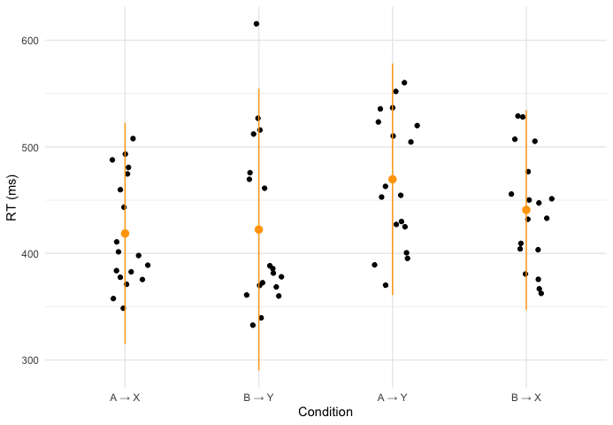

# How do Humans Structure Conditionally-Dependent Predictions?
Human-made machines tend to be carefully designed and callibrated for particular situations. But humans themselves are impressibly versatile. One component of this versatility is our ability to "predict" situations that may arise and prepare for them appropriately.

I write "predict" in scare quotes because prediction is a cognitive concept, and an ill-defined one at that. As we shall see, much of conditionally-dependent behavior can be explained by simple association. 

In our two pilot experiments, participants pressed one key if `X` appeared and another if `Y`. Two cues, `A` and `B`, had no direct relevance to the task, but could be used to predict whether `X` or `Y` was to follow.
Experiment 1.1 looks like this, where at each level (left to right) the colored veins represent conditional probabilities of the next stimulus occuring:

Experiment 1.2 looks like this:

### Competing Theories
If participants fully understood the structure of the experiment, and behaved optimally, the resulting predictions would reflect cue-conditional probabilities. Thus if `A` appeared in experiment 1.1, the optimal prediction engine would evaluate the probability of `X` at .8 and of `Y` at .2. Likewise is `B` appeared, the engine would evaluate P(`X`|`B`) at .2 and P(`Y`|`B`) at .8. Thus reaction times would be equally short for the sequences `A`→ `X` and `B`→ `Y`, since P(`X`|`A`) = P(`Y`|`B`). Reaction times for `A`→ `Y` and `B`→ `X` would be longer, but likewise equal. Do the results of experiment 1.1 look like this?

Ness and Meltzer-Asscher (2021) 
"At every stage during sentence processing, multiple representations in long-term memory are pre-activated. Many different factors contribute to the activation level of a word: the context, lexical properties of the word (e.g., frequency), idiosyncratic influences, and random noise. Once the activation level of a certain word reaches a retrieval threshold, this word is regarded as retrieved, which initiates its integration into the sentence's representation being built in WM." 

### 
