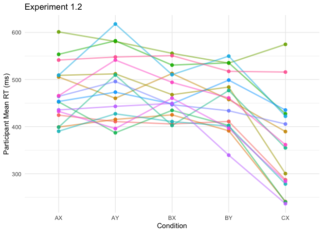
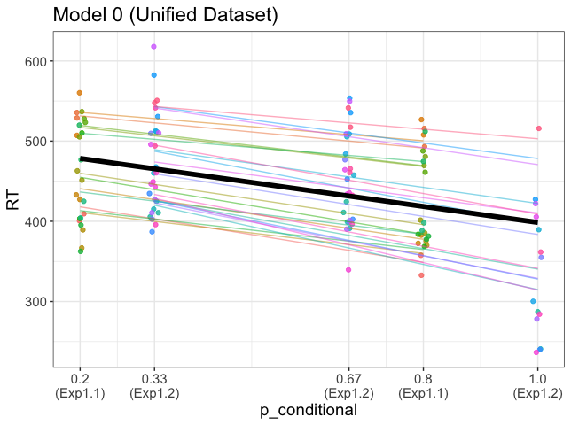

# How do Humans Structure Conditionally-Dependent Predictions?
Human-made machines tend to be carefully designed and callibrated for particular situations. But humans themselves are impressibly versatile. One component of this versatility is our ability to "predict" situations that may arise and prepare for them appropriately.

I write "predict" in scare quotes because prediction is a cognitive concept, and an ill-defined one at that. As we shall see, much of conditionally-dependent behavior can be explained by simple association. 

In our two pilot experiments, participants pressed one key if `X` appeared and another if `Y`. Two cues, `A` and `B`, had no direct relevance to the task, but could be used to predict whether `X` or `Y` was to follow.
Experiment 1.1 looks like this, where at each level (left to right) the colored veins represent conditional probabilities of the next stimulus occuring:


Let's get an initial look at the data. I'm interested to see how consistent patterns are across participants.


Experiment 1.2 looks like this:





### Model Comparisons
#### The Dataset
The following models will be trained three times each: once on the data from experiment 1.1, once on the data from experiment 1.2, and once on a unified dataset. All datasets are aggregated by participant means within each condition.

```r
> d_agg
# A tibble: 152 × 10
# Groups:   ID, condition, cue, probe, p_cue, p_global, p_conditional [152]
       ID condition cue   probe p_cue p_global p_conditional best_guess    RT correct
    <int> <chr>     <chr> <chr> <dbl>    <dbl>         <dbl>      <dbl> <dbl>   <dbl>
 1 166623 AX        A     X       0.8     0.68           0.8          1  358.       1
 2 166623 AY        A     Y       0.8     0.32           0.2          0  401.       1
 3 166623 BX        B     X       0.2     0.68           0.2          0  409.       1
 4 166623 BY        B     Y       0.2     0.32           0.8          1  333.       1
 5 166626 AX        A     X       0.8     0.68           0.8          1  493.       1
 6 166626 AY        A     Y       0.8     0.32           0.2          0  536.       1
 7 166626 BX        B     X       0.2     0.68           0.2          0  529.       1
 8 166626 BY        B     Y       0.2     0.32           0.8          1  516.       1
 9 166640 AX        A     X       0.8     0.68           0.8          1  460.       1
10 166640 AY        A     Y       0.8     0.32           0.2          0  552        1
# … with 142 more rows
```

#### Model 0: Conditional Probability Only
If participants fully understood the structure of the experiment, and behaved optimally, the resulting predictions would reflect cue-conditional probabilities. Thus if `A` appeared in experiment 1.1, the optimal prediction engine would evaluate the probability of `X` at .8 and of `Y` at .2. Likewise is `B` appeared, the engine would evaluate P(`X`|`B`) at .2 and P(`Y`|`B`) at .8. Thus reaction times would be equally short for the sequences `A`→ `X` and `B`→ `Y`, since P(`X`|`A`) = P(`Y`|`B`). Reaction times for `A`→ `Y` and `B`→ `X` would be longer, but likewise equal.

```r
aggmod_0 <- lm(RT ~ p_conditional, d_agg)
```
##### Results
```r
Call:
lm(formula = RT ~ p_conditional, data = d_agg)

Coefficients:
              Estimate Std. Error t value Pr(>|t|)    
(Intercept)     495.27      12.65  39.137  < 2e-16 ***
p_conditional   -93.66      20.43  -4.585 9.51e-06 ***

Call:
lm(formula = RT ~ p_conditional, data = d1_agg)

Coefficients:
              Estimate Std. Error t value Pr(>|t|)    
(Intercept)     465.91      14.39  32.379   <2e-16 ***
p_conditional   -56.06      24.68  -2.272   0.0262 *  

Call:
lm(formula = RT ~ p_conditional, data = d2_agg)

Coefficients:
              Estimate Std. Error t value Pr(>|t|)    
(Intercept)     542.76      21.36  25.416  < 2e-16 ***
p_conditional  -156.97      32.83  -4.781 8.06e-06 ***
```
Looking alright. The coefficient for the effect of p_conditional does vary drastically between the two experiments. Looking at the visual, it seems clear that this can be attributed to the `C` condition in Experiment 1.2.



While the `C` condition in Experiment 1.2 has by far the lowest RTs, the other two conditions in that experiment seems hardly different. They also seem quite a bit higher than the model expects them to be. 

Worst of all, a few of these groups look to be clustered. Especially the two Experiment 1 groups seem to be split along the y axis. Remember that `p_conditional` = 0.2 contains both `A`→ `Y` and `B`→ `X`, and `p_conditional` = 0.8 contains both `A`→ `X` and `B`→ `Y`.

#### Model 1: Summed Parallel Predictions
Maybe conditional probability is not the whole story. Context-clues in the real world often come at many levels of temporal and conceptual abstraction. Perhaps participants are generating one assessment of outcome probability based on the task as a whole (`p_global`) and another on the cues alone (`p_conditional`).

```r
aggmod_1 <- lm(RT ~ p_global + p_conditional, d_agg)
```

##### Results
```r
Call:
lm(formula = RT ~ p_global + p_conditional, data = d_agg)

Coefficients:
              Estimate Std. Error t value Pr(>|t|)    
(Intercept)     510.87      16.15  31.634  < 2e-16 ***
p_global        -36.13      23.40  -1.544    0.125    
p_conditional   -87.15      20.77  -4.196 4.64e-05 ***

Call:
lm(formula = RT ~ p_global + p_conditional, data = d1_agg)

Coefficients:
              Estimate Std. Error t value Pr(>|t|)    
(Intercept)     489.18      25.05  19.530   <2e-16 ***
p_global        -46.54      41.05  -1.134   0.2607    
p_conditional   -56.06      24.63  -2.277   0.0259 *  

Call:
lm(formula = RT ~ p_global + p_conditional, data = d2_agg)

Coefficients:
              Estimate Std. Error t value Pr(>|t|)    
(Intercept)     550.30      23.58  23.338  < 2e-16 ***
p_global        -22.72      29.75  -0.764    0.447    
p_conditional  -148.33      34.81  -4.262 5.69e-05 ***
```
This model seems to add very little to the last one. `p_global` has a small effect, if any. `p_conditional` = 0.33 and `p_conditional` = 0.67 again look to have higher RTs than the model expects. Interestingly enough, the `p_conditional` = 0.67 in the high p_global group seems to be higher than `p_conditional` = 0.33! Remember than this is the `A`→ `X` condition in Experiment 1.2.


#### Model 2: Summed Proportional Stimulus-Response Associations
Perhaps prediction is not prediction at all but rather simply the sum of stimulus-response associations. This view produces a model similar to Model 1 but subtly different.
Both experiments involve two sets of stimuli: prompts (`X` and `Y`) and cues (`A` and `B`). These four stimuli are linked to two responses, corresponding to the two prompts. 
Associations between prompts and their corresponding responses are likely to be very strong, as participants were thoroughly drilled in the paradigm prior to the test phase. Nevertheless, these connections may be variably strenghtened in proportion to the number of times participants were exposed to each stimulus-response pair. This proportion of course is equal to the global probability of each prompt appearing within the paradigm, independent of cues (`p_global`). 
Associations between cues and responses would likewise vary by frequency of exposure. Since different cues appear with different frequencies, and since the frequencies of each response are conditional on the cue, connections between cues and responses should be proportional to the product of cue probability (`p_cue`) and conditional probability (`p_conditional`). I'll call this value `p_posterior`.

```r
d_agg <- d_agg %>% mutate(p_posterior = p_cue*p_conditional)
```
Model 2 can therefore be formulated as follows:

```r
aggmod_2 <- lm(RT ~ p_global + p_posterior, d_agg)
```

##### Results
```r
Call:
lm(formula = RT ~ p_global + p_posterior, data = d_agg)

Coefficients:
            Estimate Std. Error t value Pr(>|t|)    
(Intercept)   479.93      13.51  35.534  < 2e-16 ***
p_global      -18.15      24.53  -0.740    0.461    
p_posterior  -119.69      28.01  -4.272 3.43e-05 ***

Call:
lm(formula = RT ~ p_global + p_posterior, data = d1_agg)

Coefficients:
            Estimate Std. Error t value Pr(>|t|)    
(Intercept)   461.15      22.46  20.528   <2e-16 ***
p_global      -29.18      45.92  -0.635    0.527    
p_posterior   -34.73      35.87  -0.968    0.336    

Call:
lm(formula = RT ~ p_global + p_posterior, data = d2_agg)

Coefficients:
            Estimate Std. Error t value Pr(>|t|)    
(Intercept)  494.188     17.164  28.791  < 2e-16 ***
p_global      -2.612     29.480  -0.089     0.93    
p_posterior -220.721     42.834  -5.153 1.92e-06 ***
```

This model seems to have accentuated the differences between the two Experiments: `p_posterior` is an incredible predictor in Experiment 1.2, but underwhelming in Exp. 1.1. `p_global` is once again weak, though always in the right direction.

At this point, let's stop and do a few formal model comparisons.
```r
library(flexplot)

model.comparison(aggmod_0, aggmod_1)
#>                aic      bic bayes.factor     p   rsq
#> aggmod_0 1729.027 1738.099        3.689 0.125 0.123
#> aggmod_1 1728.614 1740.710        0.271       0.137

model.comparison(aggmod_0, aggmod_2)
#>               aic      bic bayes.factor   rsq
#> aggmod_0 1729.027 1738.099        2.751 0.123
#> aggmod_2 1728.027 1740.123        0.364 0.140

model.comparison(aggmod_1, aggmod_2)
#>               aic      bic bayes.factor   rsq
#> aggmod_1 1728.614 1740.710        0.746 0.137
#> aggmod_2 1728.027 1740.123        1.341 0.140


model.comparison(aggmod_0.1, aggmod_1.1)
#>                aic     bic bayes.factor     p   rsq
#> aggmod_0.1 804.494 811.324        4.365 0.261 0.069
#> aggmod_1.1 805.165 814.271        0.229       0.086

model.comparison(aggmod_0.1, aggmod_2.1)
#>                aic     bic bayes.factor   rsq
#> aggmod_0.1 804.494 811.324       36.415 0.069
#> aggmod_2.1 809.408 818.514        0.027 0.030

model.comparison(aggmod_1.1, aggmod_2.1)
#>                aic     bic bayes.factor   rsq
#> aggmod_1.1 805.165 814.271        8.343 0.086
#> aggmod_2.1 809.408 818.514        0.120 0.030


model.comparison(aggmod_0.2, aggmod_1.2)
#>                aic     bic bayes.factor     p   rsq
#> aggmod_0.2 919.166 926.312        6.614 0.447 0.227
#> aggmod_1.2 920.562 930.090        0.151       0.232

model.comparison(aggmod_0.2, aggmod_2.2)
#>                aic     bic bayes.factor   rsq
#> aggmod_0.2 919.166 926.312        0.225 0.227
#> aggmod_2.2 913.801 923.329        4.444 0.295

model.comparison(aggmod_1.2, aggmod_2.2)
#>                aic     bic bayes.factor   rsq
#> aggmod_1.2 920.562 930.090        0.034 0.232
#> aggmod_2.2 913.801 923.329       29.391 0.295
```

Model 0 is best for Experiment 1.1, and Model 2 is best for Experiment 1.2. Model 1 is better than Model 2 for Experiment 1.1. None of the models are particularly good overall.

#### Model 3: LTM = Base Rate, WM = Conditional Best Guess

```r
aggmod_3 <- lm(RT ~ p_global + best_guess, d_agg)
```

##### Results
```r
Call:
lm(formula = RT ~ p_global + best_guess, data = d_agg)

Coefficients:
            Estimate Std. Error t value Pr(>|t|)    
(Intercept)   489.53      14.66  33.389  < 2e-16 ***
p_global      -47.47      23.59  -2.012  0.04604 *  
best_guess    -37.61      11.79  -3.190  0.00173 ** 

Call:
lm(formula = RT ~ p_global + best_guess, data = d1_agg)

Coefficients:
            Estimate Std. Error t value Pr(>|t|)    
(Intercept)   477.96      23.03  20.755   <2e-16 ***
p_global      -46.54      41.05  -1.134   0.2607    
best_guess    -33.64      14.78  -2.277   0.0259 *  

Call:
lm(formula = RT ~ p_global + best_guess, data = d2_agg)

Coefficients:
            Estimate Std. Error t value Pr(>|t|)    
(Intercept)   504.08      20.74  24.301   <2e-16 ***
p_global      -51.61      30.58  -1.687   0.0956 .  
best_guess    -44.34      18.35  -2.416   0.0181 *  
```
Finally, the coefficients look similar in all three model fits! Even visually, 


#### Model 4: LTM = Summed Proportional Associations, WM = Conditional Best Guess

##### Results
```r
Call:
lm(formula = RT ~ p_global + p_posterior + best_guess, data = d_agg)

Coefficients:
            Estimate Std. Error t value Pr(>|t|)    
(Intercept)   484.79      14.40  33.672  < 2e-16 ***
p_global      -21.15      24.73  -0.856  0.39363    
p_posterior  -100.26      34.37  -2.917  0.00409 ** 
best_guess    -13.77      14.11  -0.976  0.33063    

Call:
lm(formula = RT ~ p_global + p_posterior + best_guess, data = d1_agg)

Coefficients:
            Estimate Std. Error t value Pr(>|t|)    
(Intercept)   484.36      24.23  19.991   <2e-16 ***
p_global      -67.88      47.95  -1.415   0.1615    
p_posterior    42.67      49.34   0.865   0.3903    
best_guess    -46.44      20.94  -2.218   0.0299 *  

Call:
lm(formula = RT ~ p_global + p_posterior + best_guess, data = d2_agg)

Coefficients:
              Estimate Std. Error t value Pr(>|t|)    
(Intercept)  494.15684   18.81275  26.267  < 2e-16 ***
p_global      -2.60319   29.74007  -0.088    0.930    
p_posterior -220.83212   50.65546  -4.359 4.04e-05 ***
best_guess     0.08147   19.40974   0.004    0.997    
```

#### Model 5: LTM = Summed Proportional Associations, WM = Conditional Load Threshold

Ness and Meltzer-Asscher (2021) 
"At every stage during sentence processing, multiple representations in long-term memory are pre-activated. Many different factors contribute to the activation level of a word: the context, lexical properties of the word (e.g., frequency), idiosyncratic influences, and random noise. Once the activation level of a certain word reaches a retrieval threshold, this word is regarded as retrieved, which initiates its integration into the sentence's representation being built in WM." 

##### Results
```r
```

- Surprise: Negative Log-Probability of Outcome?
